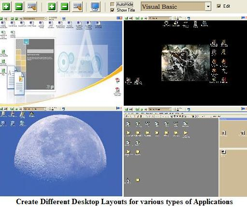



## Multiple Desktop Creator

### Description

If your Desktop is disorganized or crowded with Shortcuts, then check out Multiple Desktop Creator. Multiple Desktop Creator allows you to create an unlimited number of desktops to better organize and access all of your shortcuts. Switching between Desktops is quick and easy. You can even customize each Desktop with wallpaper that is stretched, centered or tiled. Background color and even caption font color can be customized for each Desktop. Once you try it you may never go back to your old Desktop again. (Well, maybe once in a while). The registry is not used to store information, just two small files for each logged computer user. This code is compact, lightweight and does not require any special controls or references and takes advantage of a few, simple APIs.
 
### More Info
 

             |
---                |---
**Submitted On**   |2010-03-29 10:36:14
**By**             |[Richard Gagnon](https://github.com/Planet-Source-Code/PSCIndex/blob/master/ByAuthor/richard-gagnon.md)
**Level**          |Advanced
**User Rating**    |4.8 (29 globes from 6 users)
**Compatibility**  |VB 6\.0
**Category**       |[Complete Applications](https://github.com/Planet-Source-Code/PSCIndex/blob/master/ByCategory/complete-applications__1-27.md)
**World**          |[Visual Basic](https://github.com/Planet-Source-Code/PSCIndex/blob/master/ByWorld/visual-basic.md)
**Archive File**   |[Multiple\_D2178123292010\.zip](https://github.com/Planet-Source-Code/richard-gagnon-multiple-desktop-creator__1-71255/archive/master.zip)

